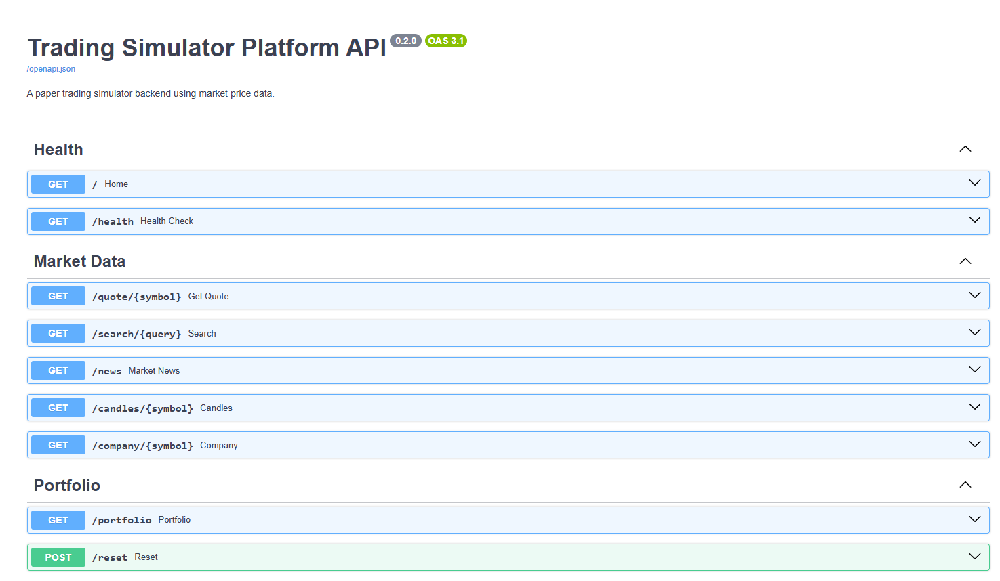
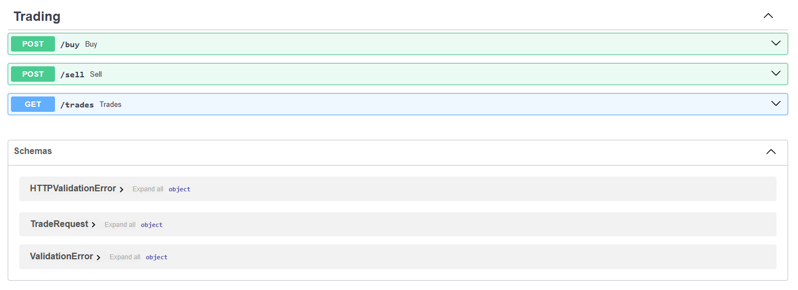
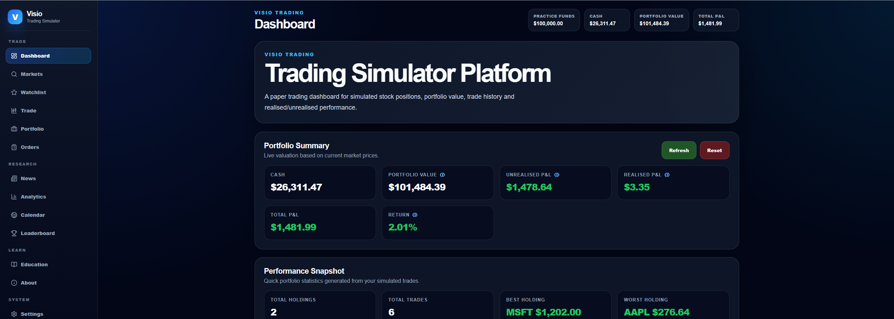
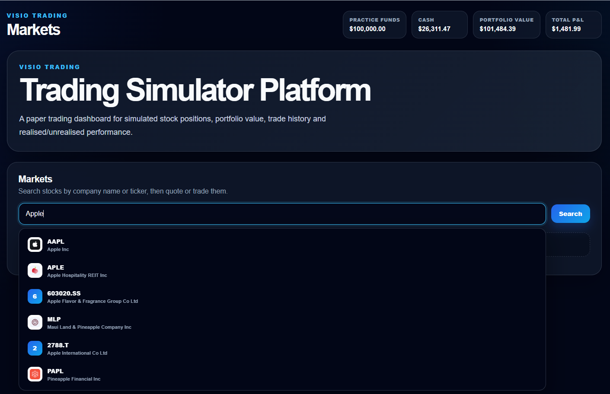
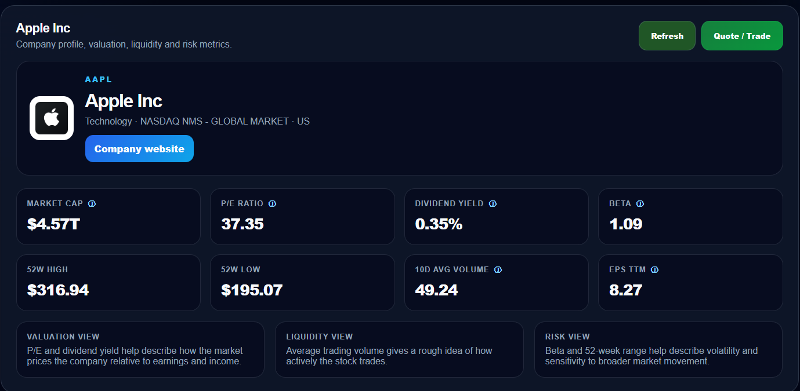
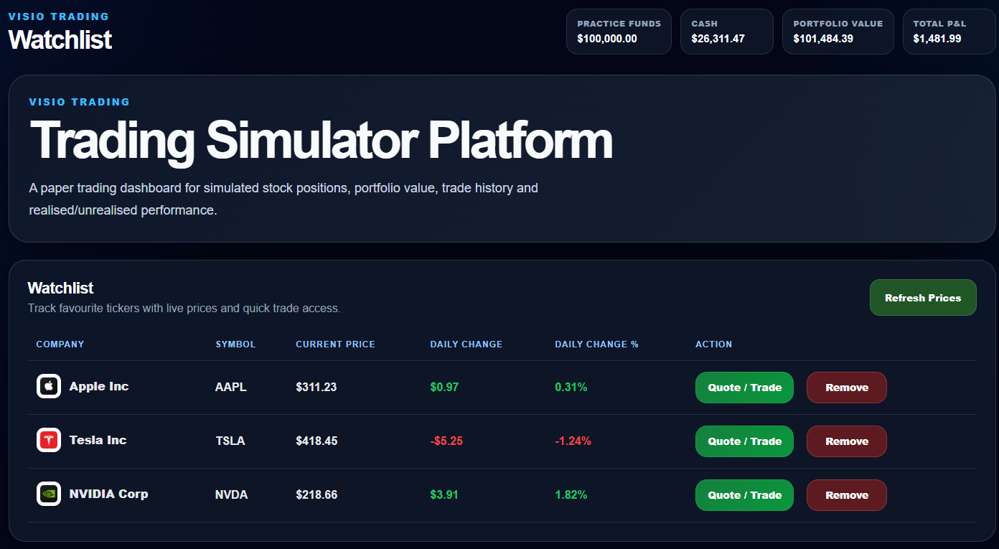
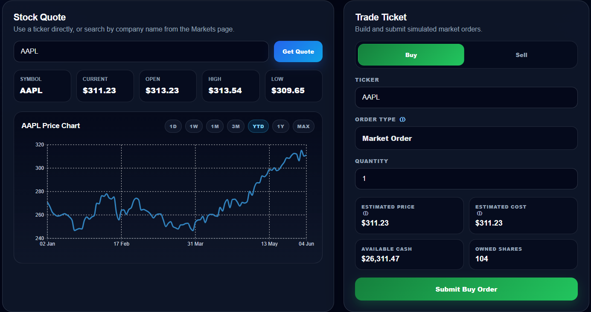
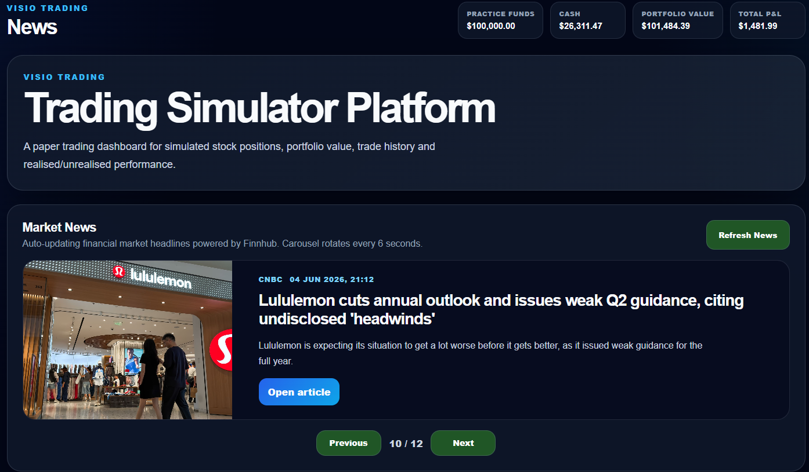
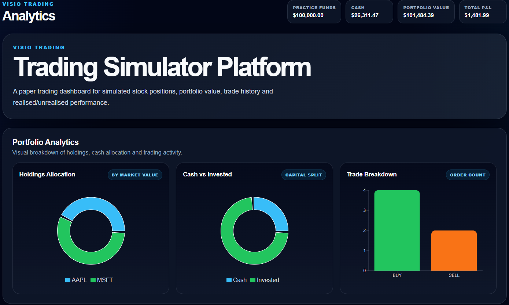

# Visio Trading — Paper Trading Simulator Platform

Visio Trading is a full-stack paper trading simulator built with React, FastAPI and SQLite. It allows users to simulate stock trades, track portfolio performance, analyse holdings, view market data, maintain a trading journal, and explore company fundamentals in a professional trading-terminal style interface.

This project was built as a finance-focused software engineering portfolio project.

---

## Screenshots

### Backend API

FastAPI backend with automatically generated API documentation and market/portfolio endpoints.





---

### Frontend Platform Showcase

The React frontend includes a dashboard, market search, watchlist, portfolio holdings, trading ticket, analytics, company research, market news, education pages and settings.















## Features

### Trading & Portfolio
- Simulated buy and sell market orders
- Cash balance and portfolio value tracking
- Portfolio holdings page with all owned stocks
- Unrealised and realised P&L calculations
- Return percentage calculations
- Trade history and trading journal
- CSV export for trades and portfolio summary
- Demo portfolio loading mode

### Market Data
- Stock quote lookup by ticker
- Company-name stock search
- Search autocomplete suggestions
- Watchlist with live prices and daily changes
- Company logos in Markets, Watchlist and Portfolio
- Company profile and fundamentals page
- Market cap, P/E ratio, dividend yield, beta, EPS, 52-week high/low and volume metrics
- Historical price charts with multiple ranges

### Dashboard & Analytics
- Portfolio summary cards
- Performance snapshot
- Best/worst holding
- Most owned and largest holding
- Cash/invested allocation
- Holdings allocation charts
- Trade breakdown charts

### Research & Learning
- Auto-rotating market news carousel
- Demo economic calendar
- Demo trader leaderboard
- Education page with 30+ trading, portfolio, valuation and risk terms
- Tooltips explaining important metrics

### Product Features
- Terminal-style sidebar navigation
- Settings page
- Compact mode
- Show/hide hero banner
- News carousel speed control
- Local browser storage controls
- About, Help, Legal and Cookie Settings pages

---

## Tech Stack

### Frontend
- React
- Vite
- Axios
- Recharts
- Lucide React
- CSS

### Backend
- Python
- FastAPI
- Uvicorn
- SQLite
- Requests
- python-dotenv

### Market Data
- Finnhub API
- Yahoo Finance fallback for historical chart data

---

## Project Structure

```text
trading-simulator-platform-visio/
│
├── backend/
│   ├── main.py
│   ├── market_data.py
│   ├── portfolio.py
│   ├── database.py
│   ├── models.py
│   ├── requirements.txt
│   └── .env.example
│
├── frontend/
│   ├── src/
│   │   ├── App.jsx
│   │   ├── App.css
│   │   └── main.jsx
│   ├── package.json
│   └── vite.config.js
│
├── docs/
├── start.bat
├── stop.bat
├── .gitignore
├── LICENSE
└── README.md